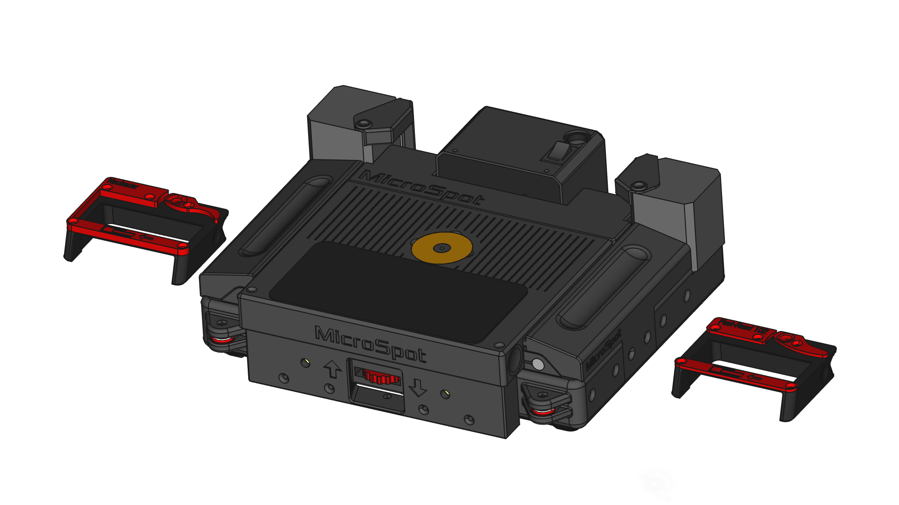
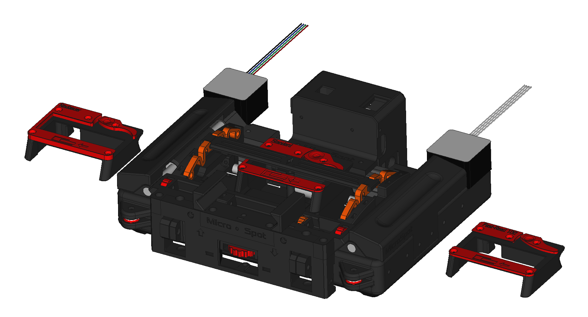

# Microspot

## Abstract

The purpose of this work is the development of a 3D printable, low cost, phone controlled, portable automated microscope that can be used to diagnose global health diseases anywhere in the world.

## The project

The device consists of a core-H mechanical stage, plus a vertical axis with a phone attached. The phone camera sees through an optical system that allows it to take pictures at a microscopic scale.

This project aims to bring medical diagnosis equipment to the open source community: Designs are made with 3D printing in mind, materials are inexpensive, and electronics accesible. The source is open from the very development stage, and the tools used to design it are open source.

This repo started as a collaboration between the Innovation and Robotics department of bq and the Technical University of Madrid, and it is currently developed within SpotLab S.L., but you can also contribute to it's development!

## Building the device

To build this device, you need to 3D print the objects indicated as "Printed" in the Assembly, and get all the items listed in the bill of materials.

+ Those groups labeled as PrintedStructural must be printed in a material that is considered suitable for structural applications. The rule of thumb is "the tougher the better".
+ Those groups labeled as PrintedTribologic must be printed in a material that holds at least some tribologic properties. They must present low friction.
+ Those gropus labeled as PrintedFlexible must be printed in flexible material.

The best way to understand how the device is made is to explore the Assembly file. Although, bill of materials and assembly instructions may be provided in the wiki.

## About this repository
This repository holds the mechanical information of the device, and wiki. Android app information and firmware information are held in other repos.

* `Mechanical`: [FreeCAD][FreeCADlink] files for the mechanical design
	* `src`: Source files in .FCStd format.
	* `Step`: Step files for component and auxiliar assembly import.
* `Optical` : Lens adapters by phone.
* `Fonts`: Fonts used in the design of the parts.
* `doc`: useful files for documentation

### Contributing to this repository. Developer notes

You can contribute to this repo by forking it, and making pull requests to the [Development branch][Develop]. If you find problems to make the contribution this way, [place an issue][issue] and we'll work it out.

Due to FCStd files being unmergeable, Assembly.FCStd is modified only on the Development branch. It may not be included in pull requests.

**This repo relies heavily on [@hamish_2014 's Assemblyv2 workbench][Assemblyv2Link].** The assembly file is composed almost entirely of Assemblyv2 objects, every file has reference items that are imported dynamically using this workbench. **These files may not be usable if your FreeCAD distribution doesn't have this workbench installed.**

Also, there may be files that use [@DeepSOIC 's Lattice2 workbench][LatticeLink]'s Recompute locker. This may be used to avoid FreeCAD to recompute a whole file each time an operation is readjusted.

## History

### Microspot v0.1

#### Specs

+ Compact design, (256x256x130mm) for easy transport.
+ Aluminum profile + 3D printed parts based frame.
+ 2 axis core-H cartesian mechanical stage controlled by an Arduino, running [GRBL based firmware][microspot-fw].
+ 50x15mm scan area.
+ Integrated LED illumination system, with regulable intensity by firmware.
+ Phone support with adaptable grip, to fit all phone sizes.

### MicroSpot v0.2.1

#### Specs

+ New compact phone crane that doesn't stick forward, reducing size to 256x200x75
+ Lower plate protecting mechanical system.
+ Lens system adaptable for every phone.
+ New carriage design that allows for detachable sample trays.
+ Sample trays for standard samples, Neubauer samples, and more.
+ Sample fixing system revisioned.
+ General usability upgrades.

### MicroSpot v0.3

#### Specs

+ New upper lid to protect the sample while scanning, featuring:
	+ New fixing system for the optics.
	+ New gel pad based fixing system for the phone.
	+ Openable by sliding forwards, allowing sample change without removing the phone.
	+ Stays closed by magnets.
+ Vertical axis revisioned.
	+ Printable linear guides, with BBs as bearings
	+ Updated knob, designed to minimize vertical backlash and ensure smooth movement.
+ Sample fixing system revisioned.
+ General assembly revisions.
+ New electronics.

## Credits

* Technical University of Madrid (Main concept & inspiration, current sponsor)
	* [@gvJaime](https://github.com/gvJaime) (Lead mechanical designer and researcher)
* Mundo Reader S.L (sponsor from October 2015 to April 2016)
	* [@gvJaime](https://github.com/gvJaime) (Lead mechanical designer and researcher)
	* [@AngelLM](https://github.com/AngelLM) (Mechanical designer. Wonderful teammate)

## License

Copyright (c) Universidad Politecnica de Madrid 2015

Licensed under Creative Commons 4.0 Attribution Share-Alike

[FreeCADlink]: http://www.freecadweb.org/
[MalariaLink]: http://malariaspot.org/
[issue]: https://github.com/malariaspot/microspot/issues/new
[Develop]: https://github.com/malariaspot/microspot/tree/Development
[microspot-fw]: https://github.com/malariaspot/microspot-fw
[Assemblyv2Link]: https://github.com/hamish2014/FreeCAD_assembly2
[LatticeLink]: https://github.com/DeepSOIC/Lattice2